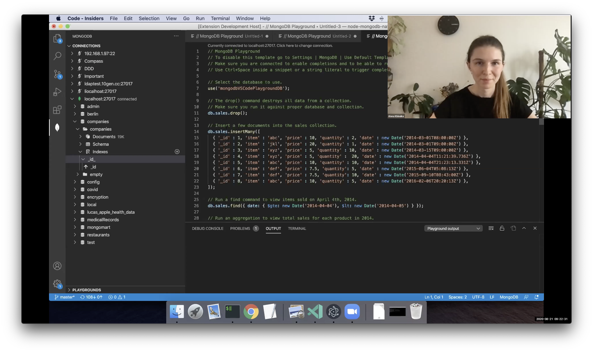

# MongoDB for VSCode

[MongoDB](https://www.mongodb.com/) demofest, 21.08.2020

At MongoDB, my team builds and maintains tools that help developers to be more productive when working with the database. A year ago we were mostly focused on the Compass app that is a great UI tool for MongoDB adoption and data visualization. But we were thinking a lot about developers’ workflows and realized, that developers have to switch between applications pretty often to solve their needs. For example, someone writes a MongoDB query in a code editor and constantly opens Compass to check data types or indexes, when it would be faster and easier to do everything in a single place. VSCode is one of the most popular code editors these days, so we decided to build the official MongoDB extension for it. In this talk, I’ll walk you through the main functionality of the extension and draw your attention to some architectural challenges we solved.

Check out the talk [recording](https://youtu.be/FdtWowJ26eg) and lear more about the language server with child threads from my [blogpost](https://medium.com/dailyjs/the-language-server-with-child-threads-38ae915f4910).

The MongoDB for VSCode [product page](https://www.mongodb.com/products/vs-code).

[Download](https://marketplace.visualstudio.com/items?itemName=mongodb.mongodb-vscode) the extension.

[Working with MongoDB](https://code.visualstudio.com/docs/azure/mongodb) tutorial from VSCode documentation.

